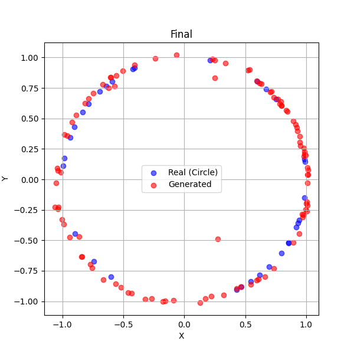
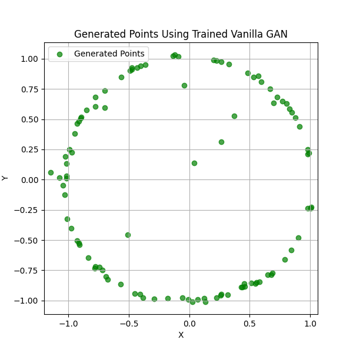
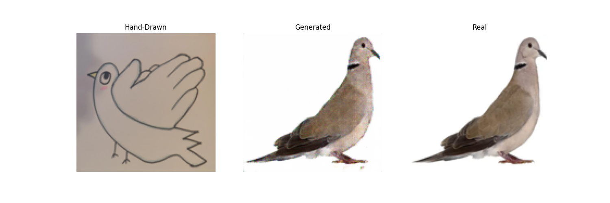
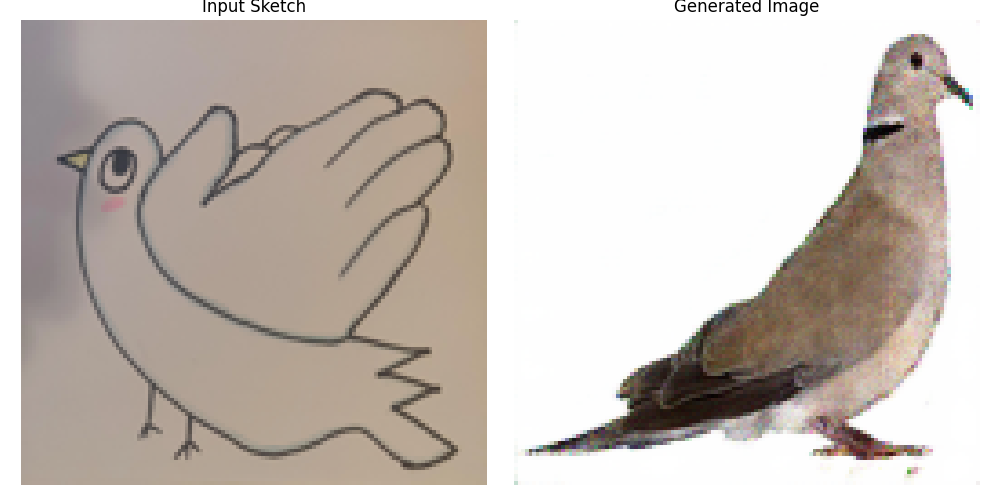
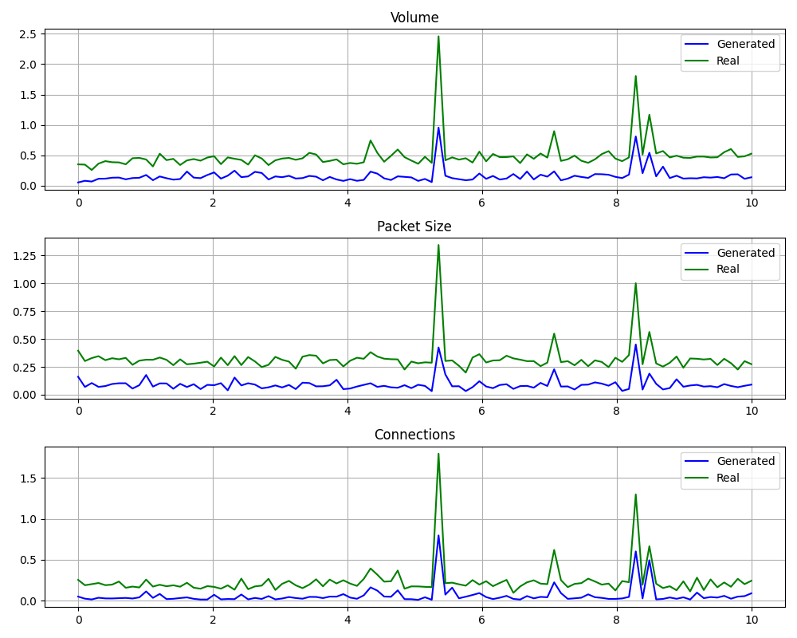
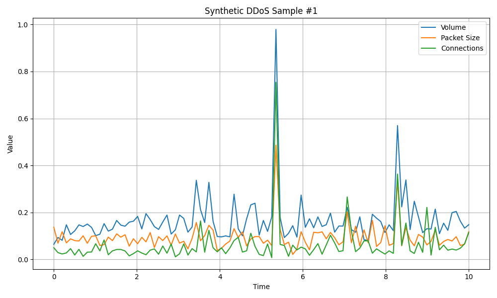

# The GANG of GANs

This is a toy project for showcasing three powerful types of Generative Adversarial Networks (GANs):

- **Vanilla GAN** – Learning to generate patterns from scratch.
- **Conditional GAN** – Learning to translate hand-drawn input into photorealistic output.
- **Deep Convolutional GAN (DCGAN)** – Generating synthetic DDoS traffic data when real-world examples are scarce or non-existent.

This repository contains ready-to-run demo scripts, visual outputs, loss plots, and model checkpoints. Whether you want to learn how GANs work or generate new data with a trained model, everything is organized and accessible.

## Substack
This repository is a companion to the article I published on Substack:
**[The Gang of GANs](https://davidwsilva.substack.com/p/the-gang-of-gans)**

## Why this project exists
GANs are among the most fascinating and impactful advances in machine learning. But many people only encounter them in abstract theory or through celebrity face generators. This project takes a different route: **simple, concrete, and insightful demos** that show GANs in action across three real-world-inspired tasks:

1. **Paint a Pattern**: A simple Vanilla GAN learns to recreate a circular distribution.
2. **Draw a Dove**: A Conditional GAN transforms a hand-drawn sketch into a realistic bird.
3. **Detect Anomaly**: A DCGAN learns to generate synthetic cyberattack traffic when real data is limited.

## Project Structure
```bash
GAN/
├── demos/
│   ├── vanilla_gan/
│   │   ├── train_vanilla_gan.py
│   │   ├── generate_vanilla.py
│   │   ├── plot_losses.py
│   │   ├── checkpoints/
│   │   └── gan_plots/
│   ├── conditional_gan/
│   │   ├── train_conditional_gan.py
│   │   ├── generate_conditional.py
│   │   ├── plot_losses.py
│   │   ├── hand_drawn_dove.png
│   │   ├── real_dove.png
│   │   ├── checkpoints/
│   │   └── gan_plots/
│   └── deep_convolutional_gan/
│       ├── deep_convolutional_gan.py
│       ├── generate_ddos_data.py
│       ├── generate_deep_convolutional.py
│       ├── checkpoints/
│       └── gan_plots/
├── gan_env/  # this is the local virtual environment
└── README.md
```

## Getting Started

### 1. Clone the repo
```bash
git clone https://github.com/yourusername/the-gang-of-gans.git
cd the-gang-of-gans
```

### 2. Create and activate a virtual environment
```bash
python3 -m venv gan_env
source gan_env/bin/activate  # On Windows: gan_env\Scripts\activate
```

### 3. Install dependencies
```bash
pip install --upgrade pip
pip install -r requirements.txt
```

If you don’t have a `requirements.txt`, here’s a minimal version:
```txt
tensorflow
matplotlib
numpy
pandas
Pillow
tqdm
imageio
```

---

## How to Use

### Train a GAN
Each demo folder includes a `train_*.py` script. For example:
```bash
python demos/vanilla_gan/train_vanilla_gan.py
```
This will:
- Train the model
- Save loss logs to `gan_plots/losses.csv`
- Save output visualizations (images)
- Save model checkpoints

### Generate Samples
Use the `generate_*.py` scripts to load trained models and generate new samples:
```bash
python demos/vanilla_gan/generate_vanilla.py
```
All generated plots and CSVs will be saved under the appropriate `gan_plots/` folder.

### Demo Previews

<table>
  <tr>
    <th colspan="2" align="left">Paint a Pattern (Vanilla GAN)</th>
  </tr>
  <tr>
    <td></td>
    <td></td>
  </tr>
  <tr>
    <th colspan="2" align="left">Draw a Dove (Conditional GAN)</th>
  </tr>
  <tr>
    <td></td>
    <td></td>
  </tr>
  <tr>
    <th colspan="2" align="left">Detect Anomaly (DCGAN)</th>
  </tr>
  <tr>
    <td></td>
    <td></td>
  </tr>
</table>

## Notes
- All demo scripts run in reasonable time and include progress bars.
- Output folders are automatically created.
- No setup required beyond cloning and installing dependencies.

## Preview Results
This repository includes actual outputs so you can view results without needing to run the training steps. Perfect if you're just exploring what GANs can do.

## Useful For
- ML students and hobbyists curious about GANs
- Researchers working on synthetic data generation
- Engineers or educators looking for clear, reproducible GAN examples

## Feedback & Contributions
PRs are welcome! If you have suggestions, fixes, or want to add a new GAN demo (e.g., CycleGAN, StyleGAN), feel free to contribute.

## License
MIT License. Use and remix freely (with attribution appreciated).
